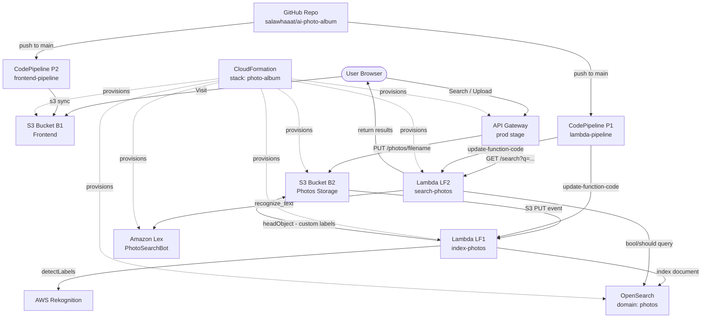

# AI Photo Album

Cloud Computing & Big Data Systems — Assignment 3  
New York University, Spring 2026

A serverless web application where users upload photos and search them using natural language. AWS Rekognition auto-detects labels in uploaded photos; a Lex NLP bot extracts keywords from search queries; OpenSearch stores and retrieves photo metadata by label.

**Live URL:** http://cc-photos-frontend-327796149266.s3-website-us-east-1.amazonaws.com

---

## Architecture



---

## How It Works

### Upload Flow
1. User selects a photo and optional custom labels in the frontend
2. Frontend sends `PUT /photos/{filename}` to API Gateway with `x-amz-meta-customLabels` header
3. API Gateway proxies the request directly to S3 B2 (no Lambda involved)
4. S3 PUT event triggers LF1 (`index-photos`)
5. LF1 calls Rekognition `detectLabels` (MaxLabels=15, MinConfidence=70)
6. LF1 reads `x-amz-meta-customlabels` from S3 object metadata
7. LF1 indexes a document into OpenSearch `photos` index with combined labels

### Search Flow
1. User types a natural language query (e.g. "show me dogs and cats")
2. Frontend sends `GET /search?q=...` to API Gateway
3. API Gateway invokes LF2 (`search-photos`)
4. LF2 sends query to Lex `PhotoSearchBot` → extracts `keyword1`, `keyword2` slots
5. LF2 queries OpenSearch with `bool/should/match` on `labels` field
6. Results returned as `[{url, labels}]` and displayed in the frontend

---

## Project Structure

```
ai-photo-album/
├── front-end/
│   ├── index.html              # Bootstrap 5 UI — search + upload
│   └── js/
│       └── app.js              # jQuery AJAX calls to API Gateway
├── lambda-functions/
│   ├── index-photos/
│   │   ├── lambda_function.py  # Rekognition + OpenSearch indexer
│   │   └── requirements.txt    # opensearch-py, requests-aws4auth
│   └── search-photos/
│       ├── lambda_function.py  # Lex keyword extraction + OpenSearch query
│       └── requirements.txt
└── other-scripts/
    ├── buildspec-lambda.yml    # CodeBuild spec for Lambda pipeline (P1)
    └── cloudformation/
        └── template.yaml       # Full infrastructure stack
```

---

## AWS Resources

| Resource | Name / ID |
|---|---|
| OpenSearch Domain | `photos` |
| S3 Frontend Bucket (B1) | `cc-photos-frontend-327796149266` |
| S3 Photos Bucket (B2) | `cc-photos-storage-327796149266` |
| Lambda LF1 | `index-photos` (Python 3.12) |
| Lambda LF2 | `search-photos` (Python 3.12) |
| API Gateway | `photo-album-api` (stage: `prod`) |
| Lex Bot | `PhotoSearchBot` — intent: `SearchIntent` |
| CodePipeline P1 | `lambda-pipeline` |
| CodePipeline P2 | `frontend-pipeline` |
| CloudFormation Stack | `photo-album` |
| AWS Region | `us-east-1` |

---

## CloudFormation

The stack provisions all core infrastructure in one command:

```bash
aws cloudformation deploy \
  --template-file other-scripts/cloudformation/template.yaml \
  --stack-name photo-album \
  --capabilities CAPABILITY_NAMED_IAM \
  --region us-east-1
```

Resources provisioned: OpenSearch domain, Lex bot + alias, S3 B1 + B2, IAM roles, Lambda LF1 + LF2, API Gateway (GET /search + PUT /photos), API key + usage plan, S3 event trigger on B2 → LF1.

---

## CI/CD

Any push to `main` triggers both pipelines automatically:

- **P1 `lambda-pipeline`** — installs dependencies, zips both Lambdas, runs `aws lambda update-function-code`
- **P2 `frontend-pipeline`** — runs `aws s3 sync front-end/ s3://cc-photos-frontend-327796149266/ --delete`

Buildspec for P1: `other-scripts/buildspec-lambda.yml`

---

## Search Examples

| Query | Type | Expected result |
|---|---|---|
| `person` | Independent label | All photos with people |
| `food` | Independent label | Florence food photos |
| `food and person` | Group labels | Photos matching food OR person |
| `Salauatka` | Custom label | Photos uploaded with that custom label |

---

## Tech Stack

- **Frontend:** HTML5, Bootstrap 5.3, jQuery 3.7.1 — no build step
- **Backend:** Python 3.12 Lambda, `opensearch-py==2.4.2`, `requests-aws4auth==1.3.1`
- **AWS Services:** S3, Lambda, API Gateway, Rekognition, Lex V2, OpenSearch, CodePipeline, CodeBuild, CloudFormation, IAM
